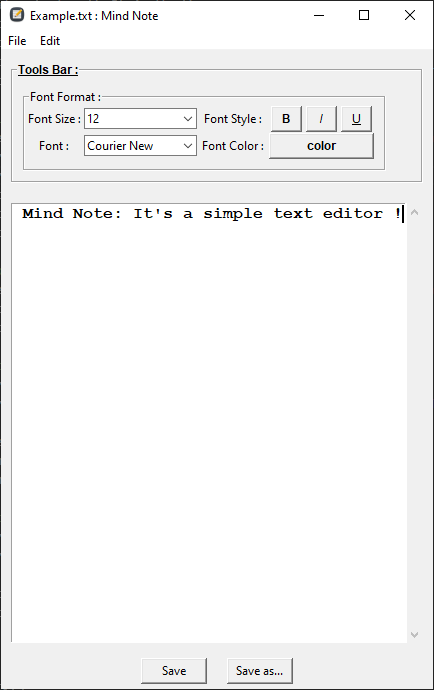

# Text Editor: Mind Note
It's a simple text editor where you write what you want. This application was developed in Python 3 on Windows 10. The GUI was made with Tkinter.



## <ins>How to use ?</ins>
Before running, make sure you have installed the library with the following command.

```
pip install -r requirement.txt
```

Then, to execute the application run the main.py script.
```
python main.py
```
